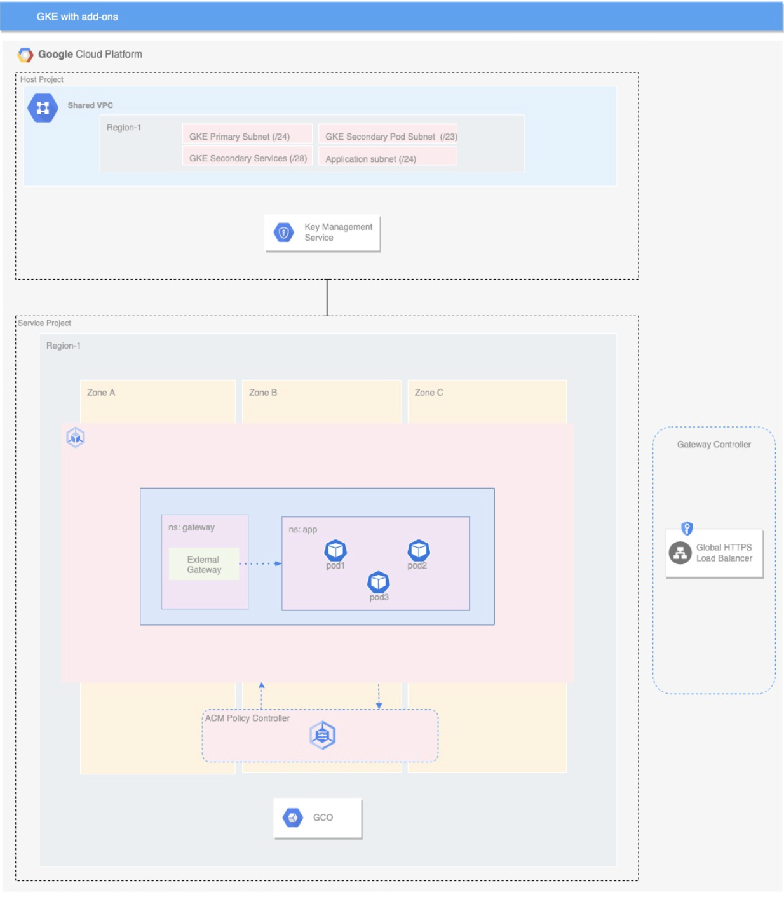

# GKE Cluster - Single Tenant

## Introduction 
This document describes a simple single tenant GKE architecture. The blueprint helps you deploy a regional GKE cluster , registers the cluster to Anthos Configuration Manager and sets up config sync. The blueprint also installs the GKE Gateway CRD to the cluster. Also included in the blueprint are kubernetes configuration files to deploy a custom application using the GKE gateway to help the user get started on using the GKE gateway. 
Here is the link to the github repository for the blueprint. 

This repo contains the following
(Terraform code)[] 
Kubernetes config files

## Architecture

In this diagram, we have an architecture of a simple GKE regional cluster, with a gateway deployed and also register the cluster to Anthos Configuration management to use policy controller.

The architecture in a single tenant GKE cluster. As show in the diagram in the preceding section this architecture creates and configures the following resources
GKE regional custer with with optional add-ons
GKE Gateway controller in separate namespace with any of the four gateway types to choose from.
GKE policy controller with constraint template library enabled.

## Pre-requisites
The architecture assumes that the following configuration is already in place and will be dependent on these resources to work as expected.

### Network
**Shared VPC** - The architecture is based on the assumption that there is a shared VPC already configured and is available and the account used to create the resources have all the required permissions required to deploy the components in the architecture.

**Subnet** - We need a subnet for the cluster nodes to be deployed in the respective region. The subnet should also have 2 secondary subnets that are to be used for the pod and services.

**CIDR range** - Determine a CIDR range to be assigned to the master node.  

**KMS** - Incase of a requirement for encrypting the data on the cluster a KMS key is required to be created and configured to be used in the cluster.

### API
Ensure that all the API’s listed below are enabled in the project where the GKE cluster needs to be deployed

- `anthos.googleapis.com`
- `gkehub.googleapis.com`
- `anthosconfigmanagement.googleapis.com`
- `container.googleapis.com`
- `gkeconnect.googleapis.com`
- `multiclusteringress.googleapis.com`
- `multiclusterservicediscovery.googleapis.com`
- `trafficdirector.googleapis.com`

### Roles
The Below listed roles should be assigned to the account that will be used to provision the resources that are defined in the architecture. 

- `roles/container.clusterAdmin`
- `roles/iam.serviceAccountUser`
- `roles/iam.serviceAccountAdmin`
- `roles/compute.networkUser`
- `roles/container.developer`
- `roles/serviceusage.serviceUsageAdmin`
- `roles/gkehub.admin`
- `roles/compute.instanceAdmin`

## Components

### GKE Single Tenant Cluster
The blueprint deploys a regional GKE cluster that can be deployed in the region of your choice. This blueprint helps you to create a public GKE cluster or a private GKE cluster with authorized networks along with a nodepool with default settings. You have additional controls to control the vertical and horizontal pod autoscaling. The architecture also supports enabling encryption on the clusters using GCP KMS keys. 
 

### GKE Gateway controller
The GKE Gateway controller is Google's implementation of the Gateway API for Cloud Load Balancing. Similar to the GKE Ingress controller, the Gateway controller watches a Kubernetes API for Gateway API resources and reconciles Cloud Load Balancing resources to implement the networking behavior specified by the Gateway resources.

There are two versions of the GKE Gateway controller:
Single-cluster: manages single-cluster Gateways for a single GKE cluster.
Multi-cluster: manages multi-cluster Gateways for one or more GKE clusters.

Both Gateway controllers are Google-hosted controllers that watch the Kubernetes API for GKE clusters. Unlike the GKE Ingress controller, the Gateway controllers are not hosted on GKE control planes or in the user project, enabling them to be more scalable and flexible.

The blueprint provided in this document helps you install Gateway API CRD’s into the GKE cluster. With these API CRD’s installed in your cluster you can now deploy regional internal or external global load balancers. Alsong with the gateway you will also need to define a HTTPRoute to allow the requests received by a Gateway to be directed to a service.  To help you get started, this blueprint also includes a sample application that implements a gateway that supports internal regional load balancer and the respective HTTPRoutes.

### Config Sync 
Applying configurations to your GKE clusters, Config Sync keeps your GKE clusters in sync with configs stored in a Git repository. The Git repository acts as the single source of truth for your cluster configuration and policies. Config Sync is declarative. It continuously checks cluster state and applies the state declared in the configuration file in order to enforce policies, which helps to prevent configuration drift.

You install Config Sync into your GKE cluster. You configure Config Sync to sync cluster configurations and policies from the GitHub repository associated with the blueprint. 

### Policy Controller
Anthos Policy Controller is a dynamic admission controller for Kubernetes that enforces CustomResourceDefinition-based (CRD-based) policies that are executed by the Open Policy Agent (OPA).
Admission controllers are Kubernetes plugins that intercept requests to the Kubernetes API server before an object is persisted, but after the request is authenticated and authorized. You can use admission controllers to limit how a cluster is used.

## LICENSE
Copyright 2022 Google LLC

Licensed under the Apache License, Version 2.0 (the "License"); you may not use this file except in compliance with the License. You may obtain a copy of the License at

`http://www.apache.org/licenses/LICENSE-2.0`

Unless required by applicable law or agreed to in writing, software distributed under the License is distributed on an "AS IS" BASIS, WITHOUT WARRANTIES OR CONDITIONS OF ANY KIND, either express or implied. See the License for the specific language governing permissions and limitations under the License.